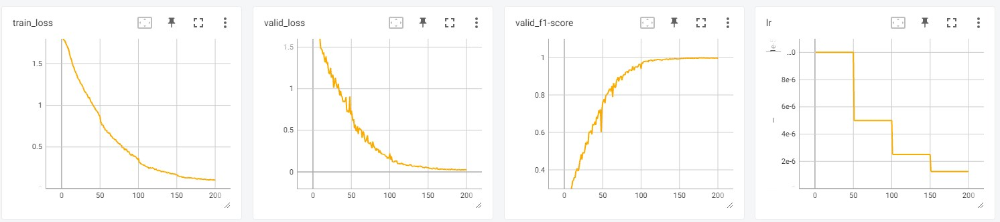

# Dataset Download

You can download the dataset from this link.
https://paperswithcode.com/dataset/fer2013

# Network Parameters

```commandline
Total params: 876,887
Trainable params: 876,887
Non-trainable params: 0
Total mult-adds (M): 596.85
==========================================================================================
Input size (MB): 0.02
Forward/backward pass size (MB): 26.50
Params size (MB): 3.35
Estimated Total Size (MB): 29.86
```


# Using Additional Datasets

## Training Hyperparameters


Random seed: 866689041

batch_size=64

lr=1e-05

max_epochs=120

Learning rate decay: scheduler = StepLR(optimizer, step_size=60, gamma=0.5)  


## Performance Metrics

Accuracy: 0.990

| expression |   pre        |      rec        |      f1-score      |    num_sample |
|----------|----------|----------|----------|----------|
|angry     |  0.9906    |        0.9896    |         0.9901      |       958       |
|disgust   |  0.9910    |        0.9910     |        0.9910      |       111      | 
|fear      |  0.9931     |       0.9834     |        0.9882      |       1024     | 
|happy     |  0.9966    |        0.9977     |        0.9972      |       1774      |
|neutral    | 0.9785     |       0.9976     |        0.9880      |       1233     | 
|sad        | 0.9927     |       0.9800     |        0.9863      |       1247     | 
|surprise   | 0.9904     |       0.9916     |        0.9910      |       831      | 


# Using FER-2013 Dataset Only

## Training Hyperparameters

random seed: 2134640168

batch_size=64

lr=1e-5

max_epochs=200

scheduler = StepLR(optimizer, step_size=50, gamma=0.5)  

## Performance Metrics

Accuracy: 0.9967957648370019

| expression |   pre        |      rec        |      f1-score      |    num_sample |
|----------|----------|----------|----------|----------|
angry     |  0.9958     |       0.9958     |        0.9958    |         958       
disgust    | 1.0000     |       0.9910      |       0.9955     |        111       
fear       | 0.9961      |      0.9902      |       0.9931     |        1024      
happy     |  0.9989      |      0.9994      |       0.9992     |        1774      
neutral   |  0.9984      |      0.9968      |       0.9976     |        1233      
sad       |  0.9936      |      0.9992       |      0.9964     |        1247      
surprise  |  0.9964      |      0.9976       |      0.9970     |        831


# Quick Start

```commandline
python3 emotion_det.py --img_path="path to your image"
```

# From the Beginning

1.training the model

```commandline
python3 train.py
tensorboard --logdir log
```


2.Convert PyTorch model to ONNX

```commandline
python3 torch2onnx.py
```

3.test
```commandline
python3 test.py
```